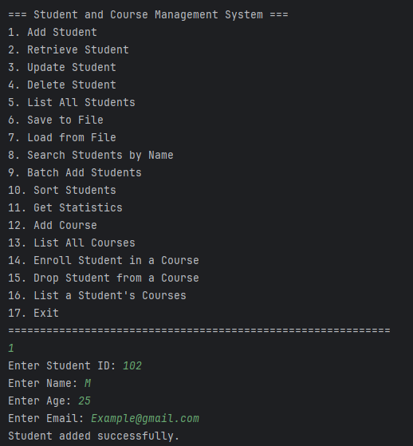
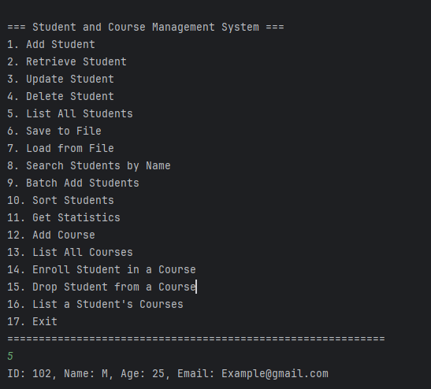

# 🎓 SWE4201 – Task 3: Java Student Record & Enrollment System

This repository contains the completed submission for **Task 3** of the **SWE4201: Introduction to Software Development** module.  
  
*Figure 1: Console interface displaying the full menu of student and course management options.*

  
*Figure 2: Console output showing a student record.*

The project showcases a modular Java application designed to manage student records, course offerings, and enrollment workflows. It applies core principles of **object-oriented programming**, **modular architecture**, and **academic presentation standards**.

---

## 📘 Table of Contents

- [Project Overview](#project-overview)  
- [System Architecture](#system-architecture)  
- [Features](#features)  
- [Demo Walkthrough](#demo-walkthrough)  
- [Development Environment](#development-environment)  
- [Installation & Execution](#installation--execution)  
- [Learning Outcomes](#learning-outcomes)  
- [Repository Standards](#repository-standards)  
- [License](#license)  
- [Author](#author)  
- [Acknowledgements](#acknowledgements)

---

## 📚 Project Overview

This Java-based system enables users to:

- Create, view, update, and delete student records  
- Manage course offerings  
- Enroll and drop students from courses  
- Persist data via file I/O  
- Interact through a structured console interface

The application emphasizes **separation of concerns**, with each class fulfilling a distinct responsibility.

---

## 🧩 System Architecture

| Class Name               | Responsibility                                      |
|--------------------------|-----------------------------------------------------|
| `Student.java`           | Models student attributes and behaviors             |
| `CourseSystem.java`      | Manages course-related data and operations          |
| `EnrollmentSystem.java`  | Handles enrollment logic and validation             |
| `StudentSystem.java`     | Coordinates student record management               |
| `Main.java`              | Entry point; integrates all subsystems              |

Compiled `.class` files are located in the `out/` directory.

---

## ✨ Features

- ✅ Modular class design for scalability and clarity  
- 🔍 Input validation and error handling  
- 🧮 Enrollment logic with course-student mapping  
- 📁 Organized source and output directories  
- 💾 File persistence for student data  
- 📊 Statistics and batch operations  
- 📄 Academic formatting and professional documentation

---

## 🧪 Demo Walkthrough

1. **Launch Application**  
   Run `Main.java` to start the console interface.

2. **Add Student**  
   Input student ID, name, age, and email.  
   → *System confirms successful addition.*

3. **Retrieve Student**  
   View stored student details by ID.  
   → *Displays structured student record.*

4. **Enroll in Course**  
   Select a course and enroll a student.  
   → *Enrollment validated and confirmed.*

5. **Save & Load Data**  
   Persist student records to file and reload as needed.

---

## 🧰 Development Environment

- **Language**: Java (JDK 8+)  
- **IDE**: IntelliJ IDEA  
- **Version Control**: Git  
- **Project Structure**:
  - `src/` – Source code  
  - `out/` – Compiled output  
  - `.idea/`, `.iml`, `.classpath`, `.project` – IDE metadata  
  - `.gitignore` – Excludes build artifacts and IDE files

---

## ⚙️ Installation & Execution

### Manual Execution (Terminal)

```bash
javac src/*.java
java -cp src Main

### IDE Execution

Open the project in **IntelliJ IDEA** and run `Main.java` using the configured run profile.

---

## 🎯 Learning Outcomes

- Applied object-oriented design principles  
- Practiced modular architecture and separation of concerns  
- Strengthened IDE proficiency and Git workflow  
- Delivered coursework with industry-standard documentation and formatting  
- Integrated file I/O and validation logic in a real-world scenario

---

## 📦 Repository Standards

- ✅ `.gitignore` configured for clean version control  
- ✅ README includes structured documentation and visual assets  
- ✅ Consistent naming conventions and code formatting  
- ✅ Metadata retained for reproducibility and IDE compatibility

---

## 📖 License

This project is licensed under the [MIT License](LICENSE) and is intended for educational and portfolio use.

---

## 👨‍💻 Author

**Mustan** – SWE4201 Student  
GitHub: [github.com/yourusername](https://github.com/yourusername)  
Portfolio: *optional link here*

---

## 🙌 Acknowledgements

Developed for **SWE4201 Task 3** under the guidance of course instructors.  
Special thanks to peers for collaborative feedback and support throughout development.

